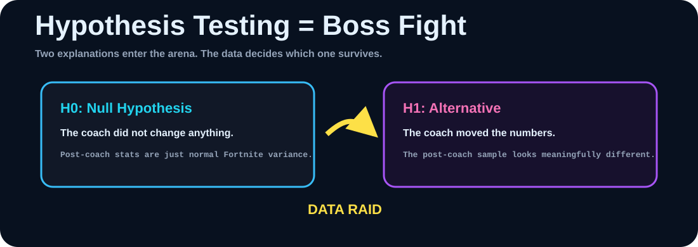
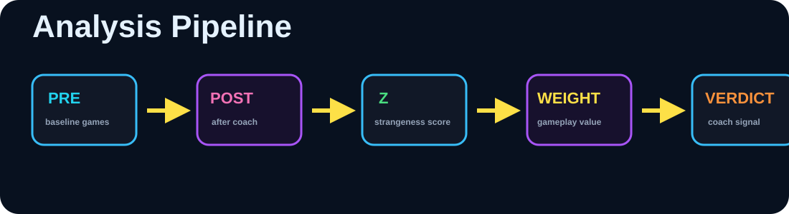
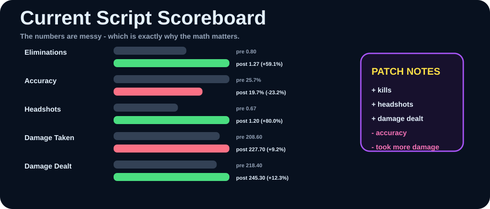
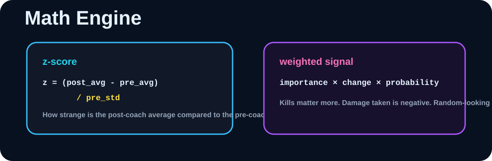
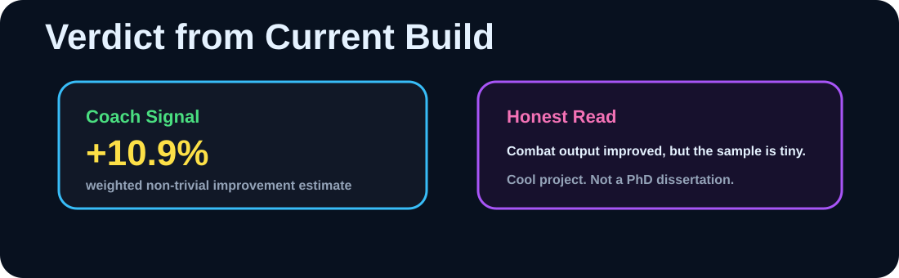

<p align="center">
  
</p>

# Did an eSports Coach Improve Me?

**Fortnite performance meets hypothesis testing.**

The question was simple:

> **Did the coach actually improve my Fortnite performance, or did I just feel improved because I had a coach?**

So I took pre-coach match stats, post-coach match stats, graphed the variables, measured how strange the changes were, and built a weighted verdict.

<p align="center">
  <a href="https://youtu.be/96Dw73wMf_c"></a>
</p>

---

## Quick Loadout

| Item | What this repo does |
|---|---|
| **Game** | Fortnite |
| **Question** | Did coaching improve performance? |
| **Tools** | Python, NumPy, SciPy, Matplotlib |
| **Stats tracked** | eliminations, accuracy, headshots, damage dealt, damage taken |
| **Main idea** | use hypothesis-testing logic to separate real improvement from noisy match variance |

---

## Hypothesis Testing in Gamer English

<p align="center">
  
</p>

Hypothesis testing is a way to make two explanations fight.

| Claim | Meaning in this project |
|---|---|
| **Null hypothesis** | The coach did nothing. The post-coach games are just normal Fortnite randomness. |
| **Alternative hypothesis** | The coach changed something. The post-coach stats moved enough to look meaningful. |

This repo does not ask, "Do I feel cracked now?"

It asks:

```text
Are the post-coach averages far enough from the pre-coach baseline
that the change is probably not just ordinary match-to-match chaos?
```

That is the educational payload: turn a personal performance question into a statistical test.

---

## The Data Raid

<p align="center">
  
</p>

The current script does this:

```text
pre-coach games
-> post-coach games
-> averages and standard deviations
-> z-scores
-> probability-style change signals
-> signed gameplay weights
-> final weighted improvement signal
```

The variables are not equally valuable. Eliminations matter a lot. Damage dealt matters. Damage taken is bad, so it gets a negative weight.

---

## Scoreboard from the Current Script

<p align="center">
  
</p>

| Metric | Pre Avg | Post Avg | Change | Direction |
|---|---:|---:|---:|---|
| **Eliminations** | 0.80 | 1.27 | **+59.1%** | Higher is better |
| **Accuracy** | 25.7% | 19.7% | **-23.2%** | Higher is better |
| **Headshots** | 0.67 | 1.20 | **+80.0%** | Higher is better |
| **Damage Taken** | 208.60 | 227.70 | **+9.2%** | Lower is better |
| **Damage Dealt** | 218.40 | 245.30 | **+12.3%** | Higher is better |

The fun read:

> More kills. More headshots. More damage dealt. Worse accuracy. Took more damage.

That mixed result is exactly why this project is interesting. The data does not give a cartoon answer. It gives a messy gamer answer, so the script weighs the evidence.

---

## The Math Engine

<p align="center">
  
</p>

The script treats the pre-coach games as the baseline world.

Then it asks how weird the post-coach average is compared to that world:

```text
z = (post_average - pre_average) / pre_standard_deviation
```

A larger absolute z-score means the post-coach result is farther from the old baseline.

Then the script turns that into a probability-style signal and combines it with percent change and gameplay importance:

```text
non_trivial_signal = weight * percent_change * probability_of_change
```

In plain English:

> A stat matters most when it changed a lot, probably changed for real, and represents something important in-game.

---

## Verdict

<p align="center">
  
</p>

Using the current entered stats and weights, the script points toward a **positive but cautious improvement signal**.

The coach appears to have improved combat output: eliminations, headshots, and damage dealt moved up. But the sample is small, accuracy moved down, and Fortnite has a lot of randomness.

So the responsible verdict is:

> **The coach probably helped, but this is exploratory stats - not courtroom evidence.**

---

## How to Run

```bash
git clone https://github.com/EmperorCodeman/Did-a-eSports-Coach-Improve-Me.git
cd Did-a-eSports-Coach-Improve-Me
python "full program.py"
```

Python packages used by the script:

```text
numpy
scipy
matplotlib
```

The script generates bar charts for the gameplay variables and conclusion charts for probability of change, percent change, and weighted non-trivial change.

---

## Honest Patch Notes

This project is intentionally raw and experimental.

- The sample size is small.
- The weights are subjective.
- Fortnite matches are noisy.
- Coaching might improve decisions that are not captured by these stats.
- The code is a prototype, not a polished statistics package.

But that is the charm.

This repo takes a real gamer question:

> "Did coaching actually make me better?"

and turns it into a measurable pipeline:

```text
match data -> graphs -> z-scores -> weighted evidence -> verdict
```

<p align="center">
  
</p>

## Why This Project Matters

This is not just a Fortnite README.

It demonstrates:

- applied hypothesis testing,
- Python data analysis,
- NumPy array work,
- SciPy normal-distribution logic,
- Matplotlib visualization,
- weighted decision systems,
- and the ability to turn a real-life question into measurable code.

**Video:** https://youtu.be/96Dw73wMf_c  
**Repository:** https://github.com/EmperorCodeman/Did-a-eSports-Coach-Improve-Me
