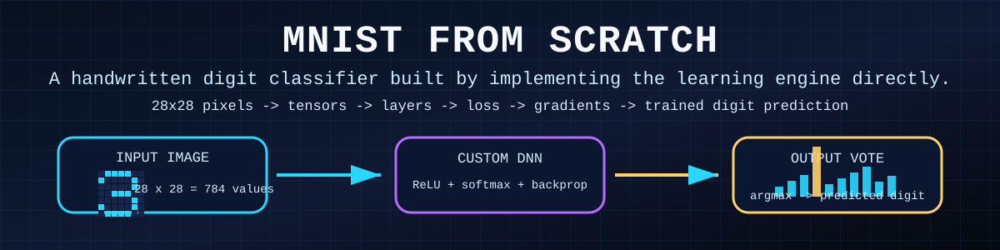
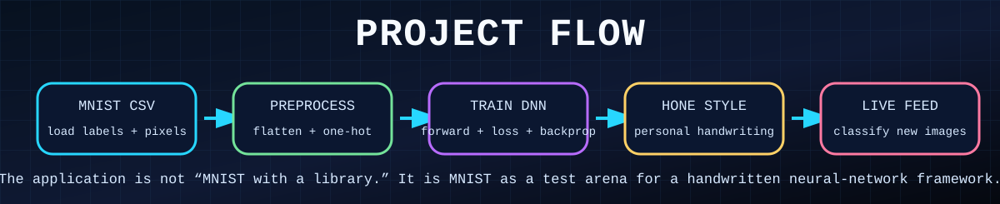
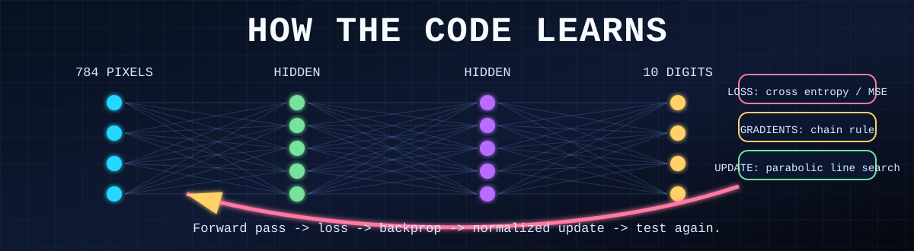
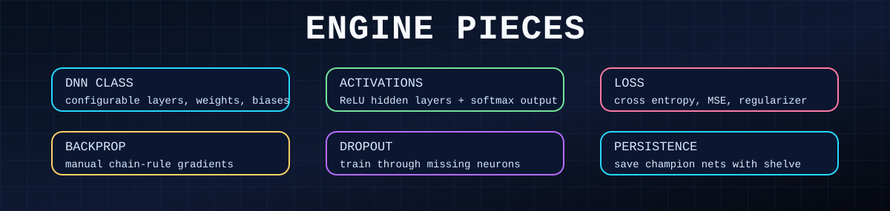

<p align="center">
  
</p>

# Neuro_Networks

**Objective:** build a neural-network framework from scratch and use MNIST as the proving ground.

MNIST is a classic handwritten-digit task: each image is a tiny `28 x 28` grayscale digit, and the model must classify it as `0` through `9`.

This repo uses that task to test the machinery of learning itself: tensors, layers, activations, loss functions, gradients, dropout, step-size search, persistence, and transfer learning onto my own handwriting.

<p align="center">
  
</p>

---

## What the application does

The application takes a digit image and turns it into a prediction.

```text
28 x 28 image
    -> 784-value input vector
    -> neural network layers
    -> 10 output scores
    -> predicted digit
```

The practical goal is simple:

> Can the model recognize handwritten digits it has not seen before?

The technical goal is deeper:

> Can I build the learning engine myself instead of outsourcing the important parts to a machine-learning framework?

---

## How I accomplished it

<p align="center">
  
</p>

The code follows a direct supervised-learning loop:

1. **Load the data** - MNIST CSV rows become image tensors and one-hot labels.
2. **Feed forward** - values flow through matrix layers, ReLU activations, and a final classifier.
3. **Measure loss** - cross entropy or mean squared error measures how wrong the output is.
4. **Backpropagate** - the chain rule computes weight and bias gradients by layer.
5. **Update carefully** - gradient steps are normalized and a parabolic line search looks for a useful step size.
6. **Test the result** - the model is checked against held-out data so improvement is not just memorization.

---

## Engine pieces in the code

<p align="center">
  
</p>

| System | What it does |
|---|---|
| `ACTIVATIONS` | Implements ReLU and numerically-stable softmax. |
| `LOSS_FUNCTIONS` | Supports cross entropy, mean squared error, and weight regularization. |
| `DNN` | Builds configurable dense neural networks from layer sizes. |
| `feed_forward()` | Pushes a batch through the network to produce predictions. |
| `get_gradient()` | Computes gradients manually with backpropagation. |
| `fit()` | Trains with mini-batches, dropout, gradient normalization, and step-size logic. |
| `MNIST.boot()` | Loads CSV/image data, preprocesses it, and saves it to `shelve` for reuse. |
| `classify_images()` | Reads images from `live_feed/` and predicts their digit labels. |
| `dream_a_mosiac()` | Runs the label-to-image experiment for “dream” mode. |

---

## MNIST data path

The MNIST classifier starts with standard digit data:

```text
mnist_train.csv
mnist_test.csv
```

Each row contains:

```text
label, pixel_1, pixel_2, ..., pixel_784
```

The code separates the label from the pixels, converts labels into one-hot vectors, transposes image data into batch-friendly matrix form, and stores prepared tensors for fast reuse.

```text
CSV rows
  -> labels + pixels
  -> one-hot supervision
  -> 784 x batch tensor
  -> train/test partitions
  -> persisted dataset
```

---

## Transfer learning: public digits to my handwriting

The repo also supports a more personal test:

```text
public MNIST digits
    -> general classifier
    -> my handwriting train set
    -> my handwriting test set
    -> live_feed prediction
```

That matters because a model can perform well on clean MNIST data and still struggle with a different pen, spacing, thickness, or personal writing style.

This turns the project from a generic MNIST demo into an applied question:

> Can the model adapt from public digit data to my own handwritten digits?

---

## Dream mode

The normal classifier asks:

```text
image -> digit label
```

Dream mode flips the direction:

```text
digit label -> generated image-like output
```

The code does this by inverting the dataset structure: labels become inputs and image tensors become outputs.

This is not the main classifier. It is a visual experiment that shows the same framework can be used in a reversed, generative direction.

---

## How to run

Main file:

```bash
python "deep neural network.py"
```

Expected local structure:

```text
Neuro_Networks/
├── deep neural network.py
├── data_sets/
│   ├── mnist_train.csv
│   ├── mnist_test.csv
│   ├── my handwritting train/
│   └── my handwritting test/
├── live_feed/
└── persistance
```

To rebuild stored data from CSV/images, use the boot path in the script:

```python
MNIST.boot(debug=False)
```

To switch the main experiment, change the application setting near the bottom of the script:

```python
application = "mnist"         # classifier
application = "dream mnist"   # label-to-image experiment
```

---

## GPU / CuPy note

The code keeps a CPU NumPy path for support/debugging and uses CuPy as the main tensor engine:

```python
import numpy as np_   # CPU helper
import cupy as np     # GPU-backed NumPy-style operations
```

Old setup notes from this repo used:

```bash
python -m pip install -U setuptools pip
pip install cupy-cuda11x
python -m cupyx.tools.install_library --cuda 11.x --library cutensor
```

CuPy setup depends on your CUDA version and local GPU environment.

---

## Vocabulary, fast

| Term | Meaning in this repo |
|---|---|
| **MNIST** | A dataset of handwritten digits from `0` to `9`. |
| **Tensor** | A matrix-like block of numbers: images, batches, weights, gradients. |
| **One-hot label** | A 10-value vector where the correct digit position is `1`. |
| **Activation** | A function that shapes neuron output, such as ReLU. |
| **Softmax** | Converts final scores into probability-like digit outputs. |
| **Loss** | A number measuring how wrong the prediction is. |
| **Gradient** | Direction each weight should move to reduce loss. |
| **Backpropagation** | Chain-rule method for computing gradients through the network. |
| **Dropout** | Randomly removes neurons during training to reduce brittle memorization. |
| **Transfer learning** | Train generally first, then adapt to a smaller target dataset. |

---

## Main files

| File | Purpose |
|---|---|
| [`deep neural network.py`](deep%20neural%20network.py) | Main DNN framework, MNIST pipeline, training loop, transfer learning, live-feed classification, dream mode. |
| [`activity report.txt`](activity%20report.txt) | Development notes about parabolic line search, batching, bias, neurons, and observed accuracy behavior. |
| [`temp.py`](temp.py) | Small image-loading / grayscale inspection scratch file. |
| `reports and logs/` | Saved logs and supporting output. |

---

## Final signal

This project is not just “run MNIST.”

It is a from-scratch learning system using MNIST as the test arena:

```text
pixels -> tensors -> layers -> loss -> gradients -> updates -> predictions
```

The classifier is the application.  
The neural-network engine is the real project.
